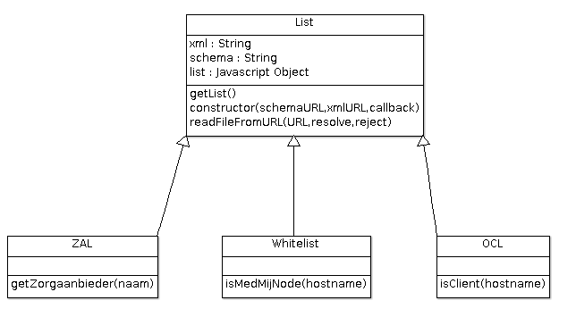

# MedMij Nodejs library

## Installation
```javascript
npm install node-medmij
```

## Design

The MedMij implementation for lists consists of four classes. First, there is a generic List class that takes care of downloading XML and schema files from URLs, validating XML's against schema and translating XML into Javascript objects. Three classes specialise the List class: they inherit from the generic List class and add specific methods for Whitelist, Zorgaanbiederslijst and OAuth client list.




## Whitelist
On creation the whitelist object downloads the whitelist schema, the whitelist itself and then validates the whitelist against the schema.
```javascript
var medmij = require('node-medmij');
new medmij.Whitelist(function(error, whitelist) {
  // do something with the whitelist
});
```

Settings are in `src/settings.js`. Following settings are relevant for whitelist parsing:
```
{
  ...
  "whitelistSchemaURL": "https://afsprakenstelsel.medmij.nl/download/...",
  "whitelistURL": "https://afsprakenstelsel.medmij.nl/download/...",
  ...
```

To get the complete whitelist:
```javascript
console.log(whitelist.getList());
// an array of whitelisted MedMij nodes
```

To validate a hostname:
```javascript
console.log(whitelist.isMedMijNode('iets'));
// false
```

## Zorgaanbiederslijst
On creation the ZAL object downloads the Zorgaanbiederslijst schema, the Zorgaanbiederslijst itself and then validates the list against the schema.
```javascript
var medmij = require('node-medmij');
new medmij.ZAL(function(error, zal) {
  // do something with the Zorgaanbiederslijst
});
```

Settings are in `src/settings.js`. Following settings are relevant for the Zorgaanbiederslijst:
```
{
  ...
  "zalSchemaURL" : "https://afsprakenstelsel.medmij.nl/download/...",
  "zalURL" : "https://afsprakenstelsel.medmij.nl/download/...",
  ...
}
```

To get the complete Zorgaanbiederslijst:
```javascript
console.log(zal.getList());
// an array of Zorgaanbieders
```

To get a zorgaanbieder by name:
```javascript
console.log(zal.getZorgaanbieder('umcharderwijk@medmij'));
// returns the complete object
```
The name is matched with `Zorgaanbiedernaam`.


## OpenAuth Client list
On creation the OCL object downloads the OAuth Client List schema, the client list itself and then validates the list against the schema.
```javascript
var medmij = require('node-medmij');
new medmij.OCL(function(error, ocl) {
  // do something with the client list
});
```

Settings are in `src/settings.js`. Following settings are relevant for the client list:
```
{
  ...
  "oclSchemaURL": "https://afsprakenstelsel.medmij.nl/download/...",
  "oclURL": "https://afsprakenstelsel.medmij.nl/download/..."
}
```

To get the complete client list:
```javascript
console.log(ocl.getList());
// an array of OAuth clients
```

To get a OAuth client by name:
```javascript
console.log(ocl.getZorgaanbieder('De Enige Echte PGO'));
// returns the complete object
```
The name is matched with `OAuthclientOrganisatienaam`.


## Testing
Unit tests are written using jasmine-node. These can be started as follows:
```javascript
npm test
```
or 
```javascript
jasmine-node ./test
```


## Settings
Current settings for schema and example files follow the [MedMij Afsprakenstelsel](https://afsprakenstelsel.medmij.nl/display/PUBLIC/XML-schema%27s).


## Dependencies
* `jasmine-node`: for unit testing
* `node-xmllint`: for validating XML files against schemas
* `xml2js`: for translating XML files to Javascript objects


## License
[GNU AFFERO GENERAL PUBLIC LICENSE Version 3](https://www.gnu.org/licenses/agpl-3.0.en.html)
